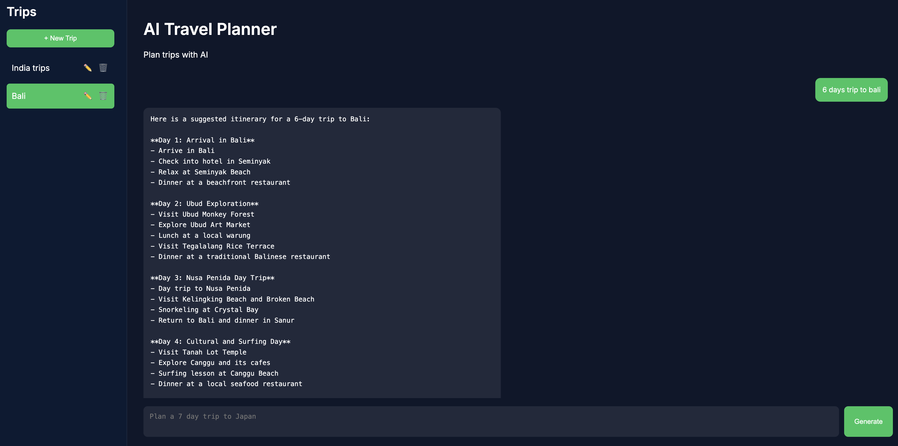

# AI Travel Planner Agent

AI Travel Planner Agent is an intelligent travel planning system that generates personalized travel itineraries through a conversational interface.

Users can create multiple trip sessions, ask follow-up questions, and iteratively refine travel plans while maintaining organized trip history.

The system combines an AI planning agent, persistent trip storage, and a lightweight chat-based UI to simulate how modern AI assistants help users plan trips.

---

# Overview

The application provides a conversational interface where users interact with an AI agent to generate and refine travel itineraries.

Each trip is stored as an independent session that preserves its planning history, allowing users to iteratively modify travel plans without affecting other trips.

Typical usage flow:

User asks:

Plan a 6 day trip to Bali

The AI agent generates a structured itinerary including daily activities and recommendations.

Users can refine the plan with follow-up prompts such as:

Make it budget friendly
Add beach activities
Extend the trip to 8 days

Each refinement becomes part of the trip’s conversation history.

---

# Architecture

<!-- ```text
User Query
   ↓
Trip Session Manager
   ↓
AI Travel Planning Agent
   ↓
LLM Reasoning Engine
   ↓
Generate Travel Plan (input → output)
   ↓
Persist Plan to Trip Storage
   ↓
Render Conversation in UI
``` -->

```text

                              ┌───────────────────────┐
                              │        Client         │
                              │     Web / Mobile      │
                              └───────────┬───────────┘
                                          │
                                          ▼
                              ┌────────────────────────┐
                              │      Load Balancer     │
                              │         (Nginx)        │
                              └───────────┬────────────┘
                                          │
             ┌────────────────────────────┼────────────────────────────┐
             ▼                            ▼                            ▼
      ┌────────────────┐           ┌────────────────┐           ┌────────────────┐
      │   Travel API   │           │   Travel API   │           │   Travel API   │
      │   Instance 1   │           │   Instance 2   │           │   Instance 3   │
      │    (FastAPI)   │           │    (FastAPI)   │           │    (FastAPI)   │
      └───────┬────────┘           └───────┬────────┘           └───────┬────────┘
              │                            │                            │
              └───────────────┬────────────┴────────────┬───────────────┘
                              ▼                         ▼
                     ┌──────────────────────────────────────────┐
                     │              Kafka Cluster               │
                     │           Event Streaming Bus            │
                     │       Topics: planner / research         │
                     │       transport / accommodation          │
                     └─────────────────────┬────────────────────┘
                                           │
         ┌─────────────────────────────────┼─────────────────────────────────┐
         ▼                                 ▼                                 ▼
 ┌─────────────────┐               ┌─────────────────┐               ┌─────────────────┐
 │  Research       │               │  Transport      │               │ Accommodation   │
 │  Worker Pool    │               │  Worker Pool    │               │  Worker Pool    │
 │  (Consumers)    │               │  (Consumers)    │               │  (Consumers)    │
 └─────────┬───────┘               └─────────┬───────┘               └─────────┬───────┘
           │                                 │                                 │
           └───────────────────────┬─────────┴─────────┬───────────────────────┘
                                   ▼                   ▼
                        ┌─────────────────────────────────────┐
                        │        Travel Planner Database      │
                        │         PostgreSQL / Redis          │
                        │   Trips • Itineraries • Results     │
                        └─────────────────────────────────────┘

```

---

# System Architecture

The project follows a lightweight layered architecture.

Frontend Layer
Handles UI rendering, chat interaction, and trip navigation.

API Layer
FastAPI backend responsible for request handling and trip management.

Agent Layer
Processes user prompts and generates travel itineraries using an LLM.

Persistence Layer
Stores trip sessions and generated plans in JSON files.

Flow:

```text
Frontend UI (Vanilla JS)
↓
FastAPI Backend
↓
AI Travel Planning Agent
↓
Trip Session Storage (JSON)
```

---

# Agent Workflow

```text
User creates or selects a trip session
↓
User sends a travel request (destination, duration, preferences, budget)
↓
Request is forwarded to the AI planning agent
↓
LLM generates a structured travel itinerary
↓
Plan is returned to the backend
↓
Plan is persisted to trip session storage
↓
Frontend renders the response as chat bubbles
```

---

# Key Features

```text
✔ Conversational travel planning
✔ Multiple trip sessions
✔ Iterative itinerary refinement
✔ Persistent trip storage
✔ Trip rename and deletion
✔ Chat-style interaction interface
✔ Lightweight local storage architecture
✔ Simple deployment with minimal dependencies
```

---

# Tech Stack

```text
Backend
Python
FastAPI

AI
OpenAI API

Frontend
Vanilla JavaScript
HTML
CSS

Storage
JSON file-based storage
```

---

# Data Model

Each trip session is stored as a JSON document.

Trip structure:

```json
{
  "id": "trip-id",
  "title": "Trip Name",
  "plans": [
    {
      "id": "plan-id",
      "plan": {
        "input": "User prompt",
        "output": "Generated itinerary"
      }
    }
  ]
}
```

Each entry in `plans` represents a conversation interaction between the user and the AI travel planning agent.

This structure allows the system to maintain the full planning history of each trip.

---

# Project Structure

```
ai-travel-planner-agent

backend
 ├── routes
 │    └── trips_routes.py
 ├── services
 │    └── trip_service.py
 ├── agents
 │    └── travel_planner_agent.py
 └── utils
      └── config.py

frontend
 ├── static
 │    ├── app.js
 │    └── styles.css
 └── templates
      └── index.html

trips
 └── JSON trip storage
```

---

# Trip Session Management

Each trip functions as an independent planning session.

Users can maintain multiple trips simultaneously and refine travel plans through conversation.

Trip sessions store the entire planning history, enabling iterative travel planning similar to modern AI assistants.

---

# UI Interaction Model

```text
Sidebar

• Create new trips
• Rename existing trips
• Delete trips
• Navigate between trip sessions

Chat Interface

• User prompt input
• AI-generated itinerary response
• Persistent conversation per trip
```

---

# Storage Design

The system uses file-based JSON storage for simplicity and transparency.

Advantages of this approach:

No database dependency
Easy debugging and inspection
Human-readable trip history
Lightweight development environment

---

# Example Interaction

User:

```
Plan a 6 day trip to Bali
```

Agent Response:

```
Day 1 – Arrival in Bali
Day 2 – Explore Ubud temples and rice terraces
Day 3 – Nusa Penida island tour
Day 4 – Tanah Lot sunset and Canggu beach
Day 5 – Beach relaxation and spa
Day 6 – Departure
```

User refinement:

```
Make the trip budget friendly
```

The agent returns an updated itinerary while preserving the trip session.

---

# Running the Project

Start the FastAPI server:

```bash
uvicorn main:app --reload or uvicorn backend.main:app --reload
```

Open the application in your browser:

```
http://localhost:8000
```

---

# Screenshots

• Chat interface
• Trip sidebar
• Generated travel itinerary



---

<!--
# Future Improvements

• Structured itinerary UI (days, activities, budget)
• Travel cost estimation
• Flight and hotel API integration
• Vector memory for travel context
• Multi-agent planning workflow
• Multi-user authentication
-->
